# Startup Productivity Platform (Azure)

[](https://opensource.org/licenses/MIT)
[](https://azure.microsoft.com/en-us/services/kubernetes-service/)
[](https://kubernetes.io/)
[](https://docs.microsoft.com/en-us/azure/azure-resource-manager/bicep/)
[](https://helm.sh/)
[](https://www.ansible.com/)

A complete self-hosted SaaS productivity suite deployed on Azure Kubernetes Service (AKS) with subdomain routing. This platform provides startups and small businesses with essential business applications including LMS, file storage, CRM, HR management, and email services.

## 🚀 Features

### Core Applications
- **📚 Moodle** - Learning Management System for training and education
- **☁️ Nextcloud** - Secure file storage and collaboration platform
- **🤝 SuiteCRM** - Customer Relationship Management system
- **👥 OrangeHRM** - Human Resource Management solution
- **📧 Roundcube** - Modern webmail client

### Infrastructure Highlights
- **Azure Kubernetes Service (AKS)** - Scalable container orchestration
- **Subdomain Routing** - Clean URLs for each application
- **SSL/TLS Termination** - Secure HTTPS connections
- **Infrastructure as Code** - Reproducible deployments with Bicep
- **Application Management** - Helm charts for easy updates and rollbacks

## 🏗️ Architecture

```mermaid
graph TB
    subgraph "Azure Cloud Infrastructure"
        subgraph "DNS & Traffic Management"
            DNS[Azure DNS Zone<br/>*.yourdomain.com]
            AGW[Application Gateway<br/>SSL Termination & Routing]
            LB[Azure Load Balancer<br/>Layer 4 Load Balancing]
        end
        
        subgraph "Network Security"
            VNet[Virtual Network<br/>10.0.0.0/16]
            NSG[Network Security Groups<br/>Traffic Control]
            Firewall[Azure Firewall<br/>Network Protection]
        end
        
        subgraph "Kubernetes Cluster"
            AKS[Azure Kubernetes Service<br/>Container Orchestration]
            SystemNodes[System Node Pool<br/>Standard_D2s_v3]
            UserNodes[User Node Pool<br/>Standard_D4s_v3]
        end
        
        subgraph "Business Applications"
            Moodle[📚 Moodle LMS<br/>moodle.domain.com]
            Nextcloud[☁️ Nextcloud<br/>files.domain.com]
            SuiteCRM[🤝 SuiteCRM<br/>crm.domain.com]
            OrangeHRM[👥 OrangeHRM<br/>hr.domain.com]
            Roundcube[📧 Roundcube<br/>mail.domain.com]
        end
        
        subgraph "Data & Storage"
            ACR[Azure Container Registry<br/>Docker Images]
            Storage[Azure Storage Account<br/>Persistent Volumes]
            Database[Azure Database<br/>PostgreSQL/MySQL]
            KeyVault[Azure Key Vault<br/>Secrets & Certificates]
        end
        
        subgraph "Monitoring & Management"
            Monitor[Azure Monitor<br/>Metrics & Alerts]
            Insights[Application Insights<br/>APM & Diagnostics]
            LogAnalytics[Log Analytics<br/>Centralized Logging]
        end
        
        subgraph "DevOps & Automation"
            DevOps[Azure DevOps<br/>CI/CD Pipelines]
            Ansible[Ansible<br/>Configuration Management]
            Helm[Helm Charts<br/>Application Deployment]
        end
    end
    
    subgraph "External Access"
        Users[👥 End Users]
        Admins[👨‍💼 Administrators]
        Developers[👨‍💻 Developers]
    end
    
    %% User Traffic Flow
    Users --> DNS
    DNS --> AGW
    AGW --> LB
    LB --> AKS
    
    %% Application Routing
    AKS --> Moodle
    AKS --> Nextcloud
    AKS --> SuiteCRM
    AKS --> OrangeHRM
    AKS --> Roundcube
    
    %% Infrastructure Dependencies
    AKS --> ACR
    AKS --> Storage
    AKS --> Database
    AKS --> KeyVault
    
    %% Monitoring Flow
    AKS --> Monitor
    AKS --> Insights
    AKS --> LogAnalytics
    
    %% DevOps Flow
    Developers --> DevOps
    DevOps --> ACR
    DevOps --> AKS
    Admins --> Ansible
    Ansible --> AKS
    Helm --> AKS
    
    %% Network Security
    VNet --> AKS
    NSG --> AKS
    Firewall --> VNet

    %% Styling
    classDef azure fill:#0078d4,stroke:#fff,stroke-width:2px,color:#fff
    classDef apps fill:#28a745,stroke:#fff,stroke-width:2px,color:#fff
    classDef storage fill:#fd7e14,stroke:#fff,stroke-width:2px,color:#fff
    classDef monitoring fill:#6f42c1,stroke:#fff,stroke-width:2px,color:#fff
    classDef users fill:#dc3545,stroke:#fff,stroke-width:2px,color:#fff
    
    class DNS,AGW,LB,VNet,NSG,Firewall,AKS azure
    class Moodle,Nextcloud,SuiteCRM,OrangeHRM,Roundcube apps
    class ACR,Storage,Database,KeyVault storage
    class Monitor,Insights,LogAnalytics monitoring
    class Users,Admins,Developers users
```



## 🛠️ Technology Stack

| Component | Technology | Purpose |
|-----------|------------|---------|
| **Infrastructure** | Azure Bicep | Infrastructure as Code |
| **Orchestration** | Azure Kubernetes Service | Container management |
| **Application Deployment** | Helm Charts | Application package management |
| **Configuration Management** | Ansible (optional) | Post-deployment configuration |
| **Load Balancing** | Azure Load Balancer | Traffic distribution and SSL termination |
| **DNS** | Azure DNS | Domain and subdomain management |
| **Storage** | Azure Storage Account | Persistent volume claims |

## 📋 Prerequisites

- Azure CLI installed and configured
- kubectl installed
- Helm 3.x installed
- Bicep CLI installed
- Azure subscription with sufficient permissions
- Domain name for subdomain routing
- (Optional) Ansible for post-deployment tasks

## 🚀 Quick Start

### 1. Clone the Repository
```bash
git clone https://github.com/sat0ps/startup-saas-azure.git
cd startup-saas-azure
```

### 2. Configure Variables
```bash
# Copy and edit the configuration file
cp config/variables.example.json config/variables.json

# Edit with your specific values
vim config/variables.json
```

### 3. Deploy Infrastructure
```bash
# Deploy Azure resources with Bicep
az deployment group create \
  --resource-group your-resource-group \
  --template-file bicep/main.bicep \
  --parameters @config/variables.json
```

### 4. Connect to AKS Cluster
```bash
# Get AKS credentials
az aks get-credentials \
  --resource-group your-resource-group \
  --name your-aks-cluster-name
```

### 5. Deploy Applications
```bash
# Add Helm repositories
helm repo add stable https://charts.helm.sh/stable
helm repo add nextcloud https://nextcloud.github.io/helm/
helm repo update

# Deploy all applications
./scripts/deploy-apps.sh
```

### 6. Configure DNS
```bash
# Get Load Balancer IP
kubectl get service ingress-nginx-controller -n ingress-nginx

# Update your domain's DNS records to point subdomains to the Load Balancer IP
```

## 📁 Project Structure

```
startup-saas-azure/
├── bicep/                    # Azure Bicep templates
│   ├── main.bicep           # Main infrastructure template
│   ├── modules/             # Reusable Bicep modules
│   └── parameters/          # Parameter files for different environments
├── helm/                    # Helm charts and values
│   ├── moodle/             # Moodle Helm chart configuration
│   ├── nextcloud/          # Nextcloud Helm chart configuration
│   ├── suitecrm/           # SuiteCRM Helm chart configuration
│   ├── orangehrm/          # OrangeHRM Helm chart configuration
│   └── roundcube/          # Roundcube Helm chart configuration
├── ansible/                # Optional Ansible playbooks
│   ├── playbooks/          # Post-deployment configuration
│   └── inventory/          # Ansible inventory files
├── scripts/                # Deployment and utility scripts
│   ├── deploy-infra.sh     # Infrastructure deployment script
│   ├── deploy-apps.sh      # Application deployment script
│   └── cleanup.sh          # Environment cleanup script
├── config/                 # Configuration files
│   ├── variables.json      # Main configuration
│   └── secrets/            # Sensitive configuration (gitignored)
└── docs/                   # Additional documentation
    ├── DEPLOYMENT.md       # Detailed deployment guide
    ├── CONFIGURATION.md    # Configuration reference
    └── TROUBLESHOOTING.md  # Common issues and solutions
```

## ⚙️ Configuration

### Core Settings
The main configuration is handled through `config/variables.json`:

```json
{
  "resourceGroup": "startup-saas-rg",
  "location": "East US",
  "aksClusterName": "startup-saas-aks",
  "nodeCount": 3,
  "nodeVmSize": "Standard_D2s_v3",
  "domainName": "yourdomain.com",
  "adminEmail": "admin@yourdomain.com"
}
```

### Application-Specific Configuration
Each application has its own Helm values file in the `helm/` directory for customization.

## 🔐 Security Considerations

- SSL/TLS certificates are automatically managed via cert-manager
- All applications run in isolated namespaces
- Network policies restrict inter-pod communication
- Azure Key Vault integration for sensitive data
- Regular security updates through automated pipelines

## 📊 Monitoring and Observability

- **Azure Monitor** integration for cluster metrics
- **Application Insights** for application performance monitoring
- **Log Analytics** workspace for centralized logging
- **Grafana** dashboards for custom metrics (optional)

## 💰 Cost Optimization

- **Auto-scaling** enabled for cost efficiency
- **Spot instances** available for non-critical workloads
- **Resource quotas** to prevent cost overruns
- **Azure Cost Management** integration

## 🔧 Maintenance

### Updates
```bash
# Update Helm charts
helm repo update
./scripts/update-apps.sh

# Update AKS cluster
az aks upgrade --resource-group your-rg --name your-cluster
```

### Backups
- Automated database backups via Azure Backup
- Nextcloud data backed up to Azure Storage
- Configuration backups stored in Azure DevOps

## 🐛 Troubleshooting

### Common Issues

**Pods stuck in Pending state**
```bash
kubectl describe pod <pod-name> -n <namespace>
# Check for resource constraints or node affinity issues
```

**SSL Certificate issues**
```bash
kubectl get certificates -A
kubectl describe certificate <cert-name> -n <namespace>
```

**Application not accessible**
```bash
kubectl get ingress -A
kubectl describe ingress <ingress-name> -n <namespace>
```

## 📖 Documentation

- [Detailed Deployment Guide](docs/DEPLOYMENT.md)
- [Configuration Reference](docs/CONFIGURATION.md)
- [Troubleshooting Guide](docs/TROUBLESHOOTING.md)
- [API Documentation](docs/API.md)

## 🤝 Contributing

1. Fork the repository
2. Create a feature branch (`git checkout -b feature/amazing-feature`)
3. Commit your changes (`git commit -m 'Add amazing feature'`)
4. Push to the branch (`git push origin feature/amazing-feature`)
5. Open a Pull Request

## 📄 License

This project is licensed under the MIT License - see the [LICENSE](LICENSE) file for details.

## 🆘 Support

- **Documentation**: Check the [docs/](docs/) directory
- **Issues**: Report bugs via GitHub Issues
- **Discussions**: Use GitHub Discussions for questions
- **Email**: Contact the maintainer at [your-email@domain.com]

## 🎯 Roadmap

- [ ] Multi-tenant support
- [ ] Advanced monitoring with Prometheus/Grafana
- [ ] CI/CD pipeline with Azure DevOps
- [ ] Disaster recovery automation
- [ ] Multi-region deployment support
- [ ] Integration with Azure AD

## ⭐ Acknowledgments

- Azure Kubernetes Service team for excellent documentation
- Helm community for maintaining application charts
- Open source projects: Moodle, Nextcloud, SuiteCRM, OrangeHRM, Roundcube

---

**Made with ❤️ for startups building on Azure**
